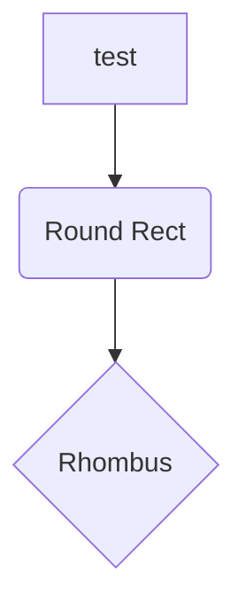

# mermaid-js
Some notes on Mermaid JS

## Github Now Supports Mermaid JS

```mermaid
flowchart TD
  A[test] --> B(Round Rect)
  B --> C{Rhombus}
```

## Basic Flowchart

```mermaid
flowchart TD
  A[test] --> B(Round Rect)
  B --> C{Rhombus}
```
